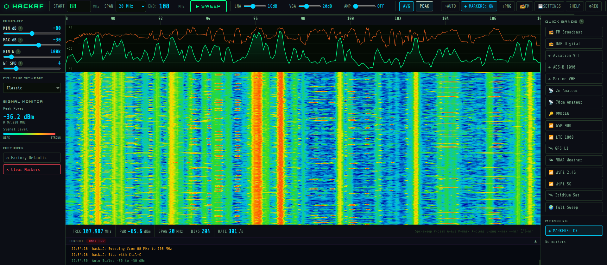

# ⬡ HackRF Sweep — Real-Time Browser-Based Spectrum Analyser

**A fully browser-based real-time radio spectrum analyser for the HackRF One SDR.**  
Scan any frequency from 1 MHz to 6 GHz and view a live waterfall + spectrum display in any web browser — on any device on your network. No desktop app, no GUI toolkit, just Python and a browser.

Created by [G4EA5](https://github.com/G4EA5) — bug reports, suggestions and pull requests welcome.

---

## 📸 Screenshots



---

## 🔍 What Is It?

This tool uses a **HackRF One** software-defined radio to continuously scan a chosen frequency range and display two real-time views side by side:

- **Spectrum graph** — power (dBm) vs frequency, shown as a green line. Peaks are transmitters. An orange peak-hold line optionally latches the highest signal ever seen.
- **Waterfall** — a scrolling colour map where time moves downward. Each horizontal line is one complete sweep. Bright vertical stripes are active transmitters. Colour goes from black/dark blue (weak or no signal) → green → yellow → red/white (very strong signal).

The server runs on any Linux, macOS or Windows (WSL2) machine with a HackRF plugged in. You open any browser — on the same machine, or on a phone or tablet on the same network — to view and control everything live.

---

## ✨ Features

### Display
- Live waterfall and spectrum at up to 400+ sweeps/second
- Full HackRF frequency range: **1 MHz to 6 GHz**
- Span locked to **multiples of 20 MHz** — eliminates the chunk boundary corruption that causes phantom signals (see [Why 20 MHz?](#-why-20-mhz-matters) below)
- Smooth waterfall accumulation — combines multiple sweeps per row for a clean, solid display (configurable speed)
- **5 colour schemes** — Classic, Grayscale, Night Vision, Hot, Viridis
- **Auto Scale** — analyses the current scan and sets Min/Max dB automatically
- **Peak Hold** — orange line holds the highest signal ever seen at each frequency
- **Averaging** — exponential moving average on the spectrum line reduces noise
- Frequency ruler with smart tick spacing across the full range
- dB axis labels on the spectrum
- Cursor readout showing exact frequency (MHz) and power (dBm) under the mouse

### Controls
- **LNA gain** 0–40 dB (steps of 8) — Low Noise Amplifier, main sensitivity control
- **VGA gain** 0–62 dB (steps of 2) — Variable Gain Amplifier, fine level control
- **RF Amp** ON/OFF — built-in ~11 dB broadband pre-amplifier
- **Bin width** — frequency resolution per sample (50k–500k Hz)
- **Waterfall speed** — sweeps accumulated per row (1–16)
- All gain controls debounced — dragging a slider doesn't restart the sweep on every pixel

### Quick Bands
One-click jump to named frequency bands, with the active band highlighted:
- 📻 FM Broadcast (87–107 MHz)
- 📻 DAB Digital Radio (174–194 MHz)
- ✈ Aviation VHF (118–138 MHz)
- ✈ ADS-B Aircraft Transponders (1080–1100 MHz)
- ⚓ Marine VHF (156–176 MHz)
- 📡 2m Amateur (144–164 MHz)
- 📡 70cm Amateur (430–450 MHz)
- 🔑 PMR446 (446–466 MHz)
- 📶 GSM 900 (860–900 MHz)
- 📶 LTE 1800 (1800–1840 MHz)
- 🛰 GPS L1 (1560–1580 MHz)
- 🌤 NOAA Weather Satellite (136–156 MHz)
- 📶 WiFi 2.4 GHz (2400–2500 MHz)
- 📶 WiFi 5 GHz (5160–5660 MHz)
- 🛰 Iridium Satellite (1616–1636 MHz)
- 🌍 Full HackRF Sweep (1 MHz–6 GHz)

### Markers
- Click anywhere on the waterfall or spectrum to drop a labelled frequency marker
- Markers shown on the ruler, spectrum and waterfall simultaneously
- Right-click on the waterfall near a marker to remove it
- Marker list in the right panel with individual delete buttons

### Signal Monitor
- Live peak power readout (dBm) for the current sweep
- Peak frequency display
- Signal strength bar graph

### FM Listen *(experimental)*
- Tune to any FM broadcast station (87.5–108 MHz) and listen via the browser
- Runs `hackrf_transfer` piped through `sox` on the server alongside the sweep
- Record button to capture audio to file
- Requires `sox` installed on the server (see dependencies)

### Settings
- **Save settings** — persists all controls (frequency, gain, display) to browser local storage
- **Load settings** — restores saved settings and applies immediately
- **Factory defaults** — one button to reset everything to sensible starting values
- Settings auto-load on page startup if previously saved

### Reliability & Error Handling
- **Stall detection** — automatically restarts `hackrf_sweep` if no data arrives for 8 seconds
- **Port cleanup** — frees TCP port 8085 on startup so re-running after a crash always works
- **Device cleanup** — detects and kills any other process holding `/dev/hackrf0` on startup
- **Sweep generation tracking** — stale data from the old sweep is discarded after a frequency change, preventing the frequency mapping bug that caused phantom signals
- **Confirmed range protocol** — the browser only updates its frequency map when the server sends a confirmed `range` message after the old process is fully dead and the queue drained
- **Throttled stderr** — hackrf_sweep's "sweeps completed" messages are throttled to 1-in-50 to prevent the console flooding the browser DOM
- **Auto-restart** — if hackrf_sweep crashes, the server detects it and restarts automatically
- **WebSocket reconnect** — browser reconnects automatically if the connection drops

### Other
- **Screenshot export** — saves ruler + spectrum + waterfall as a PNG with timestamp and frequency label
- **Keyboard shortcuts** — Space, P, A, M, X, S, +, -, [, ]
- **Tooltip help** on every control — click the ? icon for a full explanation
- **Help modal** — complete usage guide in the browser
- **Requirements modal** — installation instructions for all platforms
- **Console panel** — all HackRF errors and status messages shown live, auto-expands on error
- Browser page title updates to show current frequency range

---

## ⚠ Why 20 MHz Matters

This is the most important technical detail of this project and is not well documented elsewhere.

The HackRF One processes radio signals in **exactly 20 MHz hardware chunks** internally. When you ask `hackrf_sweep` to scan a range, it divides the span into 20 MHz chunks and sweeps each one in turn.

**If your span is not a multiple of 20 MHz** — for example 88–109 MHz (21 MHz) — the hardware uses two chunks: one for 88–108 MHz and a second partial chunk for 108–128 MHz. The second chunk begins with DC offset, LO leakage and noise from the tuner retuning to a new centre frequency. That noise gets mixed into the tail of your displayed range, causing:

- **Phantom signals** that don't exist in real life
- **Signals appearing at wrong frequencies** — e.g. an FM station showing at 85.1 MHz when the first one is at 87.6 MHz
- The **noise floor rising** across the whole display
- The **sweep rate halving** because two chunks require twice the processing

This tool enforces 20 MHz multiples by design. The span selector only offers values that are exact multiples of 20 MHz (20, 40, 60, 80, 100, 160, 200, 260, 500, 760 MHz and so on up to 5980 MHz). You set your start frequency freely, the end frequency is calculated automatically. It is impossible to accidentally select a bad span.

---

## 📋 Requirements

### Hardware
- **HackRF One** — original (Great Scott Gadgets) or any compatible clone
- **USB 2.0 or 3.0** port — USB 3.0 recommended for wide-span sweeps
- **Antenna** — any antenna appropriate for your frequency of interest. A short wire works fine for FM broadcast. A telescopic whip or discone covers a wide range.

### Software — All Platforms
- **Python 3.7 or later**
- **pip packages:** `flask` and `flask-sock`
  ```bash
  pip3 install flask flask-sock
  ```
- **hackrf tools** — provides `hackrf_sweep` and `hackrf_info` and `hackrf_transfer`
- **lsof** — used to find processes holding the device or port
- **fuser** (part of psmisc) — used to force-release the device
- **sox** *(optional)* — only needed for the FM listen/record feature

---

## 🖥 Platform-Specific Installation

### Ubuntu / Debian / Linux Mint / Pop!_OS

Tested and fully supported.

```bash
# Install system dependencies
sudo apt update
sudo apt install hackrf lsof psmisc sox python3 python3-pip

# Install Python packages
pip3 install flask flask-sock

# Verify HackRF is detected
hackrf_info
```

### Raspberry Pi OS (Raspbian)

Fully supported. A Pi 3B+ or better is recommended — a Pi Zero will struggle with wide spans at high sweep rates.

```bash
sudo apt update
sudo apt install hackrf lsof psmisc sox python3 python3-pip
pip3 install flask flask-sock
hackrf_info
```

### Kali Linux

Fully supported. hackrf tools are often pre-installed.

```bash
sudo apt install hackrf lsof psmisc sox
pip3 install flask flask-sock
hackrf_info
```

### Fedora / RHEL / CentOS / AlmaLinux

```bash
sudo dnf install hackrf lsof psmisc sox python3 python3-pip
pip3 install flask flask-sock
hackrf_info
```

### Arch Linux / Manjaro

```bash
sudo pacman -S hackrf lsof psmisc sox python python-pip
pip3 install flask flask-sock
hackrf_info
```

### openSUSE

```bash
sudo zypper install hackrf lsof psmisc sox python3 python3-pip
pip3 install flask flask-sock
hackrf_info
```

### macOS (Homebrew)

Mostly works. Note that sudo behaviour on macOS differs from Linux — automatic process cleanup on startup may be less reliable. Tested on macOS 12 Monterey and later.

```bash
# Install Homebrew if you don't have it
/bin/bash -c "$(curl -fsSL https://raw.githubusercontent.com/Homebrew/install/HEAD/install.sh)"

# Install dependencies
brew install hackrf sox python3

# lsof is pre-installed on macOS
# fuser is not available — the server falls back to lsof only on macOS

pip3 install flask flask-sock

# Verify
hackrf_info
```

> **macOS note:** You may need to allow the HackRF USB device in System Preferences → Security & Privacy after first plugging it in.

### Windows (WSL2)

Windows is not natively supported because `hackrf_sweep` is a Linux binary. However, it works well under WSL2 (Windows Subsystem for Linux) with USB passthrough via `usbipd-win`.

**Step 1 — Install WSL2 and Ubuntu:**
```powershell
# In PowerShell (Administrator)
wsl --install
# Restart when prompted, then open Ubuntu from the Start menu
```

**Step 2 — Install usbipd-win** to pass the HackRF USB device through to WSL2:
- Download and install from: https://github.com/dorssel/usbipd-win/releases

**Step 3 — Attach the HackRF to WSL2:**
```powershell
# In PowerShell (Administrator) — list USB devices
usbipd list
# Find your HackRF (usually shows as "HackRF One" or similar), note its BUSID

# Attach it to WSL2
usbipd bind --busid <BUSID>
usbipd attach --wsl --busid <BUSID>
```

**Step 4 — Inside your WSL2 Ubuntu terminal:**
```bash
sudo apt update
sudo apt install hackrf lsof psmisc sox python3 python3-pip
pip3 install flask flask-sock
hackrf_info   # should show your HackRF
```

**Step 5 — Run the server:**
```bash
sudo python3 server.py
```

Then open your Windows browser and go to `http://localhost:8085`

> **Note:** You must re-attach the USB device with usbipd each time you reboot Windows or unplug/replug the HackRF.

> **Windows Native:** Running natively on Windows (without WSL2) is not currently supported because `hackrf_sweep` does not have a stable Windows build. Contributions welcome.

---

## 🚀 Installation & Running

```bash
# 1. Clone the repository
git clone https://github.com/G4EA5/hackrf_sweep.git
cd hackrf_sweep

# 2. Install Python dependencies
pip3 install flask flask-sock

# 3. Install system dependencies (Debian/Ubuntu example)
sudo apt install hackrf lsof psmisc sox

# 4. Plug in your HackRF and verify it is detected
hackrf_info
# Expected output:
#   Found HackRF One
#   Index: 0
#   Serial number: ...
#   Firmware Version: ...

# 5. Run the server
sudo python3 server.py

# 6. Open your browser
# On the same machine:  http://localhost:8085
# From another device:  http://<your-ip>:8085
```

To find your machine's IP address:
```bash
ip addr show        # Linux
ifconfig            # macOS / older Linux
ipconfig            # Windows PowerShell
```

---

## 🔑 Permissions — Running Without sudo

Running with `sudo` is the simplest approach. If you prefer not to, add your user to the `plugdev` group and install the HackRF udev rules so the device is accessible without root:

```bash
# Add your user to the plugdev group
sudo usermod -aG plugdev $USER

# Install HackRF udev rules
sudo cp /usr/lib/udev/rules.d/53-hackrf.rules /etc/udev/rules.d/
# (path may vary — try /lib/udev/rules.d/ if the above doesn't exist)

# Reload udev
sudo udevadm control --reload-rules
sudo udevadm trigger

# Log out and back in for the group change to take effect

# Then run without sudo
python3 server.py
```

> **Note:** Without sudo, automatic port and device cleanup on startup will have limited permissions. If another process is holding the device or port you may need to kill it manually.

---

## 🖱 How To Use

### First Steps
1. Run the server and open your browser to `http://localhost:8085`
2. The green dot in the top bar shows **connected** — the sweep starts automatically on the FM broadcast band (87–107 MHz)
3. You should see a waterfall scrolling downward. FM stations appear as bright vertical stripes
4. If the waterfall is blank, check the **Console** panel at the bottom — it will show exactly what went wrong

### Setting Your Frequency
- **START** — type your start frequency in MHz
- **SPAN** — choose a span from the dropdown. End frequency = Start + Span. Always a multiple of 20 MHz.
- The **END** frequency is shown in cyan next to the SPAN selector
- Press **▶ SWEEP** or wait 0.8 seconds after typing — the sweep restarts automatically
- Or click any **Quick Band** button on the right panel to jump straight to a named band

### Adjusting Gain
Start with LNA=16, VGA=20, AMP=OFF. If signals look weak, increase LNA first, then VGA. If everything is saturated (all red/white), reduce VGA.

- **LNA** (Low Noise Amplifier) — biggest effect on sensitivity. 0, 8, 16, 24, 32, 40 dB
- **VGA** (Variable Gain Amplifier) — fine-tune level. 0–62 dB in steps of 2
- **AMP** — enable only for very weak signals. Can overload with strong nearby transmitters.

### Setting the Colour Scale
- **MIN dB** — set just above your noise floor. Press **⚡ AUTO** to let the software figure it out
- **MAX dB** — set to just above your strongest signals. For FM broadcast, –50 to –20 dBm is typical
- If everything looks one colour, press **⚡ AUTO SCALE**

### Keyboard Shortcuts
| Key | Action |
|---|---|
| `Space` | Restart sweep |
| `P` | Toggle Peak Hold |
| `A` | Toggle Averaging |
| `M` | Toggle Marker mode |
| `X` | Clear all markers |
| `S` | Save screenshot PNG |
| `+` / `-` | MAX dB ±5 |
| `[` / `]` | MIN dB ±5 |

### Markers
1. Click **◈ MARK** in the top bar (or press `M`)
2. Click anywhere on the waterfall or spectrum to drop a marker at that frequency
3. Markers appear on the ruler, spectrum and waterfall
4. Right-click on the waterfall near a marker to remove it
5. Use the marker list in the right panel to see and delete individual markers

### FM Listening
1. Click **📻 FM** in the top bar
2. Enter the FM station frequency in MHz (e.g. 100.0)
3. Click **▶ LISTEN**
4. The sweep continues running alongside — FM listening is a separate process
5. Requires `sox` installed on the server machine

### Saving Settings
- Click **💾 SETTINGS** → **Save Settings** — all controls are stored in browser local storage
- Next time you open the page, your settings are automatically restored
- **Factory Defaults** resets everything to sensible starting values

---

## 🛠 Troubleshooting

### Waterfall is blank / nothing showing
1. Expand the **Console** panel (click the bar at the bottom) — it will show the exact error
2. Run `hackrf_info` in a terminal — if it says "No HackRF boards found", the device is not detected
3. Check the USB cable — try a different port or cable
4. Check another program isn't using the HackRF (SDR#, GQRX, etc.) — the server kills these on startup but you may need to close them manually first
5. Try running with `sudo`

### Signals appearing at wrong frequencies / phantom signals
- Make sure you are using the SPAN dropdown, not typing a raw end frequency
- All spans are enforced as multiples of 20 MHz — this should not happen with this tool
- If it does happen, please open a GitHub issue with your start frequency and span

### All one colour (all blue or all green/yellow)
- Press **⚡ AUTO** — this analyses the current data and sets the range automatically
- Or manually adjust MIN dB and MAX dB until you see variation

### Low sweep rate / slow waterfall
- Reduce the span — wider span = more 20 MHz chunks = slower sweep
- Increase bin width (BIN W slider) — larger bins = fewer samples = faster sweep
- Close other applications using CPU
- On Raspberry Pi, a narrower span (20–40 MHz) is recommended for smooth performance

### Permission denied / can't open device
- Run with `sudo python3 server.py`
- Or follow the [permissions setup](#-permissions--running-without-sudo) to add yourself to the plugdev group

### Port 8085 already in use
- The server automatically kills whatever is holding port 8085 on startup
- If it still fails, manually: `sudo fuser -k 8085/tcp` then run again

### FM Listen not working
- Make sure `sox` is installed: `sudo apt install sox`
- `hackrf_transfer` must also be installed (part of the hackrf package)
- Check the Console panel for error messages from the server

### HackRF firmware
- Old firmware can cause unexpected behaviour. Update it:
  ```bash
  hackrf_spiflash -w hackrf_one_usb.bin
  ```
- Firmware images: https://github.com/greatscottgadgets/hackrf/releases
- Firmware 2018.01.1 or later recommended

---

## 📡 Tested Frequencies / Use Cases

The following have been tested and confirmed working:

| Band | Range | Notes |
|---|---|---|
| FM Broadcast | 87–107 MHz | Stations clearly visible as vertical stripes |
| DAB Digital Radio | 174–194 MHz | Visible where DAB is broadcast |
| Aviation VHF | 118–138 MHz | Active near airports |
| 2m Amateur | 144–164 MHz | Repeaters and simplex QSOs visible |
| 70cm Amateur | 430–450 MHz | |
| GSM 900 | 860–900 MHz | Mobile base station activity |
| GPS L1 | 1560–1580 MHz | Very weak — needs good antenna and high gain |
| WiFi 2.4 GHz | 2400–2500 MHz | 802.11 activity clearly visible |

*Higher frequency bands (5 GHz+) require a suitable antenna — results vary.*

---

## 🏗 Architecture

```
┌─────────────────────────────────────────────────────┐
│                    server.py                         │
│                                                      │
│  Flask HTTP server   ──────────────── serves HTML    │
│  Flask-Sock WS       ──────────────── real-time data │
│                                                      │
│  hackrf_sweep subprocess                             │
│  ├── stdout thread ──► stdout_q (Queue) ──► WS      │
│  └── stderr thread ──► stderr_q (Queue) ──► WS      │
│                                                      │
│  Sweep generation counter                            │
│  └── ensures stale data from old sweeps is dropped  │
└────────────────────────┬────────────────────────────┘
                         │ WebSocket
                         │ (CSV data + JSON status)
┌────────────────────────▼────────────────────────────┐
│                   Browser (any device)               │
│                                                      │
│  WebSocket client                                    │
│  └── waits for "range" confirmation before          │
│      accepting CSV data (fixes frequency mapping)    │
│                                                      │
│  CSV parser ──► sweep accumulator ──► bin clipper   │
│                         │                            │
│                         ▼                            │
│  Spectrum canvas (green line, peak hold)             │
│  Waterfall canvas (colour map, time-scrolling)       │
│  Ruler canvas (frequency labels, markers)            │
└─────────────────────────────────────────────────────┘
```

### The Confirmed Range Protocol (frequency fix)
The biggest technical challenge was preventing phantom signals when changing frequency. The root cause was a race condition:

1. User changes frequency
2. Browser updates `freqStart`/`freqEnd` immediately
3. Old `hackrf_sweep` process keeps sending data for ~600ms while it's being killed
4. That stale data (from the old frequency) gets clipped using the new frequency range
5. Result: wrong bins mapped to wrong pixel positions = phantom signals

**The fix:** The browser never updates its frequency mapping until the server sends a `{"type":"range"}` JSON message. The server only sends this message **after** the old process is killed, the stdout queue is fully drained, and the new process has started. Until that message arrives, all incoming CSV data is discarded. This makes the frequency change slightly slower to complete visually but completely accurate.

---

## 📁 Files

```
hackrf-sweep/
├── server.py       — the entire application (Python backend + HTML/CSS/JS frontend)
├── README.md       — this file
└── LICENSE         — MIT licence
```

The entire frontend (HTML, CSS, JavaScript) is embedded in `server.py` as a Python string and served by Flask's `render_template_string`. This makes the project a single-file deployment — just copy `server.py` to any machine with the dependencies installed and run it.

---

## 🔧 Configuration

The server runs on port **8085** by default. To change it, edit the last line of `server.py`:

```python
app.run(host="0.0.0.0", port=8085, threaded=True)
```

To restrict access to localhost only (more secure if you don't want it accessible on the network):
```python
app.run(host="127.0.0.1", port=8085, threaded=True)
```

---

## 🤝 Contributing

Contributions, bug reports and feature suggestions are welcome.

### Reporting Bugs
Please open a GitHub Issue and include:
- Your OS and version
- Python version (`python3 --version`)
- hackrf firmware version (`hackrf_info`)
- What you were doing when it went wrong
- The Console output from the browser (copy-paste the text)
- Any terminal output from running `server.py`

### Feature Requests
Open an Issue and describe what you'd like. Current things being considered:
- RTL-SDR version (`server_rtlsdr.py` using `rtl_power`)
- Software bandpass / notch filters on the spectrum display
- Noise floor calibration (baseline subtraction)
- Signal history / recording to file
- Multiple markers with frequency delta readout
- Mobile-responsive layout improvements

### Pull Requests
Fork the repo, make your changes, and open a PR. Please test on at least one platform before submitting.

---

## 📜 Licence

MIT Licence — free to use, modify and distribute. See [LICENSE](LICENSE) for full text.

---

## 🙏 Acknowledgements

- [Great Scott Gadgets](https://greatscottgadgets.com/) — creators of the HackRF One hardware and `hackrf_sweep` tool
- [Flask](https://flask.palletsprojects.com/) and [flask-sock](https://github.com/miguelgrinberg/flask-sock) — the Python web framework and WebSocket library that power the server
- The wider SDR community for documentation on HackRF quirks and the 20 MHz chunk behaviour

---

## 📬 Contact & Feedback

- GitHub: [github.com/G4EA5](https://github.com/G4EA5)
- Issues: [github.com/G4EA5/hackrf_sweep/issues](https://github.com/G4EA5/hackrf_sweep/issues)

If you find this useful, a ⭐ star on GitHub is always appreciated and helps others find the project!

---

*HackRF Sweep — created by [G4EA5](https://github.com/G4EA5)*
